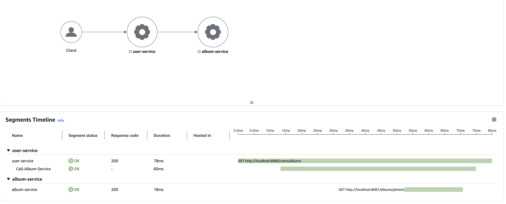

Run AWS X-Ray daemon
```shell
docker run --attach STDOUT -v ~/.aws/:/root/.aws/:ro -e AWS_REGION=ap-southeast-2 --name xray-daemon -p 2000:2000/udp xray-daemon -o -l debug
```

Run user service
```shell
cd user

export AWS_XRAY_DAEMON_ADDRESS=127.0.0.1:2000 && mvn spring-boot:run
```

Run photo service
```shell
cd album

export AWS_XRAY_DAEMON_ADDRESS=127.0.0.1:2000 && mvn spring-boot:run
```

Test the tracing
```shell
curl http://localhost:8080/users/albums
```


Build the user/photo service images
```shell
# User service
cd user
./mvnw clean package
docker build -t xray-user:latest .

# Album service
cd album
./mvnw clean package
docker build -t xray-album:latest .
```


Sample User task definition
```json
{
    "taskDefinitionArn": "arn:aws:ecs:ap-southeast-2:933822101074:task-definition/xray-user-service-task:3",
    "containerDefinitions": [
        {
            "name": "xray-user-service-container",
            "image": "933822101074.dkr.ecr.ap-southeast-2.amazonaws.com/xray-user:latest",
            "cpu": 0,
            "portMappings": [
                {
                    "name": "xray-user-service-container-8080-tcp",
                    "containerPort": 8080,
                    "hostPort": 8080,
                    "protocol": "tcp",
                    "appProtocol": "http"
                }
            ],
            "essential": true,
            "environment": [
                {
                    "name": "album.service.url",
                    "value": "http://xray-album:8081"
                }
            ],
            "mountPoints": [],
            "volumesFrom": [],
            "logConfiguration": {
                "logDriver": "awslogs",
                "options": {
                    "awslogs-group": "/ecs/xray-user-service-task",
                    "mode": "non-blocking",
                    "awslogs-create-group": "true",
                    "max-buffer-size": "25m",
                    "awslogs-region": "ap-southeast-2",
                    "awslogs-stream-prefix": "ecs"
                }
            },
            "systemControls": []
        },
        {
            "name": "xray-daemon",
            "image": "amazon/aws-xray-daemon",
            "cpu": 32,
            "memory": 256,
            "portMappings": [
                {
                    "containerPort": 2000,
                    "hostPort": 2000,
                    "protocol": "udp"
                }
            ],
            "essential": false,
            "environment": [],
            "mountPoints": [],
            "volumesFrom": [],
            "logConfiguration": {
                "logDriver": "awslogs",
                "options": {
                    "awslogs-group": "/ecs/user-service-task",
                    "awslogs-region": "ap-southeast-2",
                    "awslogs-stream-prefix": "xray"
                }
            },
            "systemControls": []
        }
    ],
    "family": "xray-user-service-task",
    "taskRoleArn": "arn:aws:iam::933822101074:role/ecsTaskExecutionRole",
    "executionRoleArn": "arn:aws:iam::933822101074:role/ecsTaskExecutionRole",
    "networkMode": "awsvpc",
    "revision": 3,
    "volumes": [],
    "status": "ACTIVE",
    "requiresAttributes": [
        {
            "name": "com.amazonaws.ecs.capability.logging-driver.awslogs"
        },
        {
            "name": "ecs.capability.execution-role-awslogs"
        },
        {
            "name": "com.amazonaws.ecs.capability.ecr-auth"
        },
        {
            "name": "com.amazonaws.ecs.capability.docker-remote-api.1.19"
        },
        {
            "name": "com.amazonaws.ecs.capability.docker-remote-api.1.28"
        },
        {
            "name": "com.amazonaws.ecs.capability.task-iam-role"
        },
        {
            "name": "ecs.capability.execution-role-ecr-pull"
        },
        {
            "name": "com.amazonaws.ecs.capability.docker-remote-api.1.18"
        },
        {
            "name": "ecs.capability.task-eni"
        },
        {
            "name": "com.amazonaws.ecs.capability.docker-remote-api.1.29"
        }
    ],
    "placementConstraints": [],
    "compatibilities": [
        "EC2",
        "FARGATE"
    ],
    "requiresCompatibilities": [
        "FARGATE"
    ],
    "cpu": "512",
    "memory": "1024",
    "runtimePlatform": {
        "cpuArchitecture": "X86_64",
        "operatingSystemFamily": "LINUX"
    },
    "registeredAt": "2025-05-01T10:12:25.037Z",
    "registeredBy": "arn:aws:iam::933822101074:user/nam1",
    "enableFaultInjection": false,
    "tags": []
}
```

Sample Album task definition
```json
{
    "taskDefinitionArn": "arn:aws:ecs:ap-southeast-2:933822101074:task-definition/xray-album-service-task:3",
    "containerDefinitions": [
        {
            "name": "xray-album-service-container",
            "image": "933822101074.dkr.ecr.ap-southeast-2.amazonaws.com/xray-album:latest",
            "cpu": 0,
            "portMappings": [
                {
                    "name": "xray-album-service-container-8081-tcp",
                    "containerPort": 8081,
                    "hostPort": 8081,
                    "protocol": "tcp",
                    "appProtocol": "http"
                }
            ],
            "essential": true,
            "environment": [],
            "mountPoints": [],
            "volumesFrom": [],
            "logConfiguration": {
                "logDriver": "awslogs",
                "options": {
                    "awslogs-group": "/ecs/xray-album-service-task",
                    "mode": "non-blocking",
                    "awslogs-create-group": "true",
                    "max-buffer-size": "25m",
                    "awslogs-region": "ap-southeast-2",
                    "awslogs-stream-prefix": "ecs"
                }
            },
            "systemControls": []
        },
        {
            "name": "xray-daemon",
            "image": "amazon/aws-xray-daemon",
            "cpu": 32,
            "memory": 256,
            "portMappings": [
                {
                    "containerPort": 2000,
                    "hostPort": 2000,
                    "protocol": "udp"
                }
            ],
            "essential": false,
            "environment": [],
            "mountPoints": [],
            "volumesFrom": [],
            "logConfiguration": {
                "logDriver": "awslogs",
                "options": {
                    "awslogs-group": "/ecs/user-service-task",
                    "awslogs-region": "ap-southeast-2",
                    "awslogs-stream-prefix": "xray"
                }
            },
            "systemControls": []
        }
    ],
    "family": "xray-album-service-task",
    "taskRoleArn": "arn:aws:iam::933822101074:role/ecsTaskExecutionRole",
    "executionRoleArn": "arn:aws:iam::933822101074:role/ecsTaskExecutionRole",
    "networkMode": "awsvpc",
    "revision": 3,
    "volumes": [],
    "status": "ACTIVE",
    "requiresAttributes": [
        {
            "name": "com.amazonaws.ecs.capability.logging-driver.awslogs"
        },
        {
            "name": "ecs.capability.execution-role-awslogs"
        },
        {
            "name": "com.amazonaws.ecs.capability.ecr-auth"
        },
        {
            "name": "com.amazonaws.ecs.capability.docker-remote-api.1.19"
        },
        {
            "name": "com.amazonaws.ecs.capability.docker-remote-api.1.28"
        },
        {
            "name": "com.amazonaws.ecs.capability.task-iam-role"
        },
        {
            "name": "ecs.capability.execution-role-ecr-pull"
        },
        {
            "name": "com.amazonaws.ecs.capability.docker-remote-api.1.18"
        },
        {
            "name": "ecs.capability.task-eni"
        },
        {
            "name": "com.amazonaws.ecs.capability.docker-remote-api.1.29"
        }
    ],
    "placementConstraints": [],
    "compatibilities": [
        "EC2",
        "FARGATE"
    ],
    "requiresCompatibilities": [
        "FARGATE"
    ],
    "cpu": "512",
    "memory": "1024",
    "runtimePlatform": {
        "cpuArchitecture": "X86_64",
        "operatingSystemFamily": "LINUX"
    },
    "registeredAt": "2025-05-01T10:13:25.891Z",
    "registeredBy": "arn:aws:iam::933822101074:user/nam1",
    "enableFaultInjection": false,
    "tags": []
}
```

make sure `ecsTaskExecutionRole` role has `AWSXRayDaemonWriteAccess` policy attached.